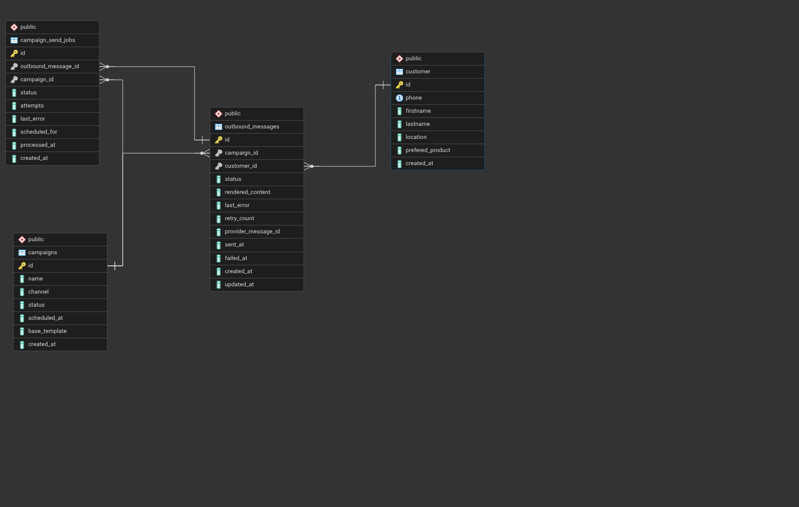
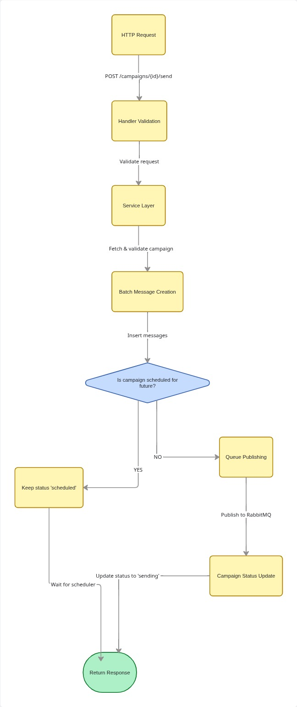
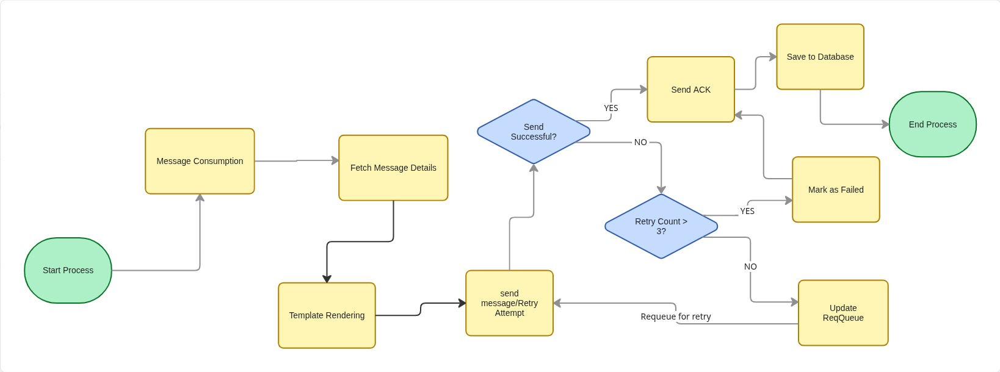

# System Overview

## 1. Data Model and Entity Relationships

### Core Entities

#### **customers** Table
Stores customer information for campaign targeting.

```sql
CREATE TABLE customer (
    id INTEGER GENERATED ALWAYS AS IDENTITY PRIMARY KEY,
    phone VARCHAR(255) NOT NULL,
    firstname VARCHAR(255) NOT NULL,
    lastname VARCHAR(255) NOT NULL,
    location VARCHAR(255),              -- Nullable
    prefered_product VARCHAR(255),      -- Nullable
    created_at TIMESTAMP NOT NULL DEFAULT CURRENT_TIMESTAMP,
    
    CONSTRAINT unique_phone UNIQUE(phone)
);
```

**Indexes:**
- `idx_customer_phone` (UNIQUE) - Fast phone lookup
- `idx_customer_location` - Filter by location
- `idx_customer_id_quick` (INCLUDE firstname, lastname, location, prefered_product) - Optimized for personalized preview queries

#### **campaigns** Table
Stores campaign metadata and configuration.

```sql
CREATE TABLE campaigns (
    id INTEGER GENERATED ALWAYS AS IDENTITY PRIMARY KEY,
    name VARCHAR(255) NOT NULL,
    channel VARCHAR(50) NOT NULL,       -- 'sms' or 'whatsapp'
    status VARCHAR(50) NOT NULL DEFAULT 'draft',  -- 'draft', 'scheduled', 'sending', 'sent', 'failed'
    scheduled_at TIMESTAMP,             -- Nullable, for scheduled campaigns
    base_template TEXT NOT NULL,        -- Message template with {placeholders}
    created_at TIMESTAMP NOT NULL DEFAULT CURRENT_TIMESTAMP,
    
    CONSTRAINT valid_channel CHECK (channel IN ('sms', 'whatsapp')),
    CONSTRAINT valid_status CHECK (status IN ('draft', 'scheduled', 'sending', 'sent', 'failed'))
);
```

**Indexes:**
- `idx_campaigns_created_at_desc` (created_at DESC, id DESC) - Pagination with stable ordering
- `idx_campaigns_channel_status` (channel, status, created_at DESC) - Filtered listing
- `idx_campaigns_status_created_at` (status, created_at DESC) - Status-based queries
- `idx_campaigns_scheduled_at` - Scheduler queries for ready campaigns

#### **outbound_messages** Table
Individual messages to be sent, linking campaigns to customers.

```sql
CREATE TABLE outbound_messages (
    id INTEGER GENERATED ALWAYS AS IDENTITY PRIMARY KEY,
    campaign_id INTEGER NOT NULL,
    customer_id INTEGER NOT NULL,
    status VARCHAR(50) NOT NULL DEFAULT 'pending',  -- 'pending', 'sending', 'sent', 'failed'
    rendered_content TEXT NOT NULL,     -- Pre-rendered message content
    last_error TEXT,
    retry_count INTEGER NOT NULL DEFAULT 0,
    provider_message_id VARCHAR(255),   -- External provider's message ID
    sent_at TIMESTAMP,
    failed_at TIMESTAMP,
    created_at TIMESTAMP NOT NULL DEFAULT CURRENT_TIMESTAMP,
    updated_at TIMESTAMP NOT NULL DEFAULT CURRENT_TIMESTAMP,
    
    CONSTRAINT fk_campaign FOREIGN KEY (campaign_id) REFERENCES campaigns(id) ON DELETE CASCADE,
    CONSTRAINT fk_customer FOREIGN KEY (customer_id) REFERENCES customer(id) ON DELETE CASCADE,
    CONSTRAINT unique_campaign_customer UNIQUE (campaign_id, customer_id)
);
```

**Indexes:**
- `idx_outbound_messages_campaign_id` - Campaign-based queries
- `idx_outbound_messages_campaign_status` - Statistics aggregation (used in GET /campaigns/{id})
- `idx_outbound_messages_campaign_pending` (campaign_id, id WHERE status = 'pending') - Scheduler batch fetching
- `idx_outbound_messages_pending_retry` (status, retry_count WHERE status IN ('pending', 'failed') AND retry_count < 3) - Retry logic

### Entity Relationships

```
customers (1) ──────< (M) outbound_messages (M) >────── (1) campaigns
    │                           │
    └─ phone (UNIQUE)           ├─ status tracking
    └─ personal data            ├─ retry_count
                                └─ rendered_content
```



**Key Relationships:**
- One campaign can have many outbound messages (one per customer)
- One customer can receive messages from many campaigns
- Each outbound message is unique per (campaign_id, customer_id) pair

---

## 2. Request Flow for `POST /campaigns/{id}/send`

### Overview
This endpoint creates outbound messages for specified customers and either queues them immediately or schedules them for future dispatch.

### Detailed Flow




---

## 3. Queue Worker Message Processing

### Architecture

The worker consumes messages from RabbitMQ and processes them with retry logic.

```
┌──────────────┐         ┌──────────────┐         ┌──────────────┐
│  RabbitMQ    │────────>│    Worker    │────────>│   Provider   │
│    Queue     │         │   Consumer   │         │   (Mock)     │
└──────────────┘         └──────────────┘         └──────────────┘
                                │
                                │ On failure
                                ▼
                         ┌──────────────┐
                         │   Retry      │
                         │   Logic      │
                         └──────────────┘
```

### Processing Flow




### Retry Logic Details

**Maximum Retries:** 3 attempts

**Retry Strategy:**
1. **First failure** (retry_count = 0):
   - Update status to 'failed', increment retry_count to 1
   - Nack message with requeue=true
   - Sleep 1 second to prevent tight loop
   - Message returns to queue for retry

2. **Second failure** (retry_count = 1):
   - Update retry_count to 2
   - Nack with requeue
   - Sleep 1 second

3. **Third failure** (retry_count = 2):
   - Update retry_count to 3
   - Status remains 'failed'
   - **Ack message** (removes from queue permanently)
   - No more retries


### Queue Configuration (RabbitMQ)

- **Queue Name:** `campaign_sends`
- **Exchange:** Default (direct)
- **Acknowledgment:** Manual (ack/nack after processing)
- **Durability:** Messages are not persisted (in-memory for this implementation)
- **Concurrency:** Single worker, single consumer (can be scaled horizontally)

### Why RabbitMQ?

I chose RabbitMQ over alternatives (Redis) for the following reasons:

1. **Reliability**: Built-in message persistence and acknowledgment
2. **Retry Support**: Dead letter exchanges for failed message handling
3. **Ease of Setup**: Simple Docker deployment for development
4. **Mature Ecosystem**: Well-documented with extensive Go client support
5. **Lightweight**: Suitable for moderate throughput (thousands of messages/sec)


---

## 4. Pagination

### Design consideration
- **Stable Ordering:** Prevent duplicates or missing records across pages
- **Performance:** Use indexed columns for efficient queries
- **Consistency:** Handle concurrent inserts gracefully

### Implementation

**Ordering Strategy:**
```sql
ORDER BY created_at DESC, id DESC
LIMIT ? OFFSET ?
```

**Why This Works:**
1. **created_at DESC** - Primary sort by creation time (most recent first)
2. **id DESC** - Tie-breaker for records with identical timestamps
3. **Composite Index** - `idx_campaigns_created_at_desc (created_at DESC, id DESC)` enables index-only scans (multiple columns)

### Avoiding Duplicates/Missing Records

**Problem:** When using `OFFSET`, if new records are inserted between page requests, items can shift and appear on multiple pages or be skipped.

**Solution:** Stable ordering with `id DESC` as tie-breaker ensures:
- Even if new campaigns are inserted with the same `created_at`, the `id` provides deterministic ordering
- Since `id` is auto-incrementing, newer records always have higher IDs
- Pagination remains consistent within a reasonable time window

**Example:**
```
Page 1 (LIMIT 20 OFFSET 0):  Campaigns with IDs 100-81
Page 2 (LIMIT 20 OFFSET 20): Campaigns with IDs 80-61

If campaign 101 is inserted after Page 1 is fetched:
- Page 2 still returns IDs 80-61 (unchanged)
- Campaign 101 would appear on Page 1 if re-fetched
```


### Pagination Metadata

Response includes:
```json
{
  "data": [...],
  "pagination": {
    "page": 1,
    "page_size": 20,
    "total_count": 150,
    "total_pages": 8
  }
}
```

### Limitations

- **Deep Pagination:** OFFSET becomes slow for large offsets (e.g., page 1000). We will have to consider cursor-based pagination using `WHERE id < last_seen_id`.
- **Concurrent Inserts:** Very high-frequency inserts may still cause minor inconsistencies. For strict consistency, we will still opt for cursor-based pagination with `id`.

---

## 5. Personalization Approach

### Template System Design

**Syntax:** Simple placeholder replacement using `{field_name}` format.

**Supported Placeholders:**
- `{first_name}` → Customer's first name
- `{last_name}` → Customer's last name
- `{phone}` → Customer's phone number
- `{location}` → Customer's location (nullable)
- `{prefered_product}` → Customer's preferred product (nullable)

**Null Handling Philosophy:**
- Nullable fields are replaced with **empty strings** (not "null" or placeholder text)
- Provides cleaner output and avoids exposing technical details to end users
- Allows templates to gracefully handle optional fields

**Example:**
```
Template: "Hi {first_name}! Check out our {prefered_product} deals in {location}!"

Customer A (location=NULL, prefered_product=NULL):
Output: "Hi John! Check out our  deals in !"

Customer B (location="Nairobi", prefered_product="Laptop"):
Output: "Hi Jane! Check out our Laptop deals in Nairobi!"
```

### Extension Points for Future Enhancements

The current template system is intentionally simple but designed for extensibility:

#### 1. **Conditional Logic**
Add support for if/else statements:
```
{if location}Visit our {location} store!{else}Shop online!{endif}
```

#### 2. **AI-Driven Content Generation**
Integrate LLM for dynamic personalization:

**Example use Cases:**
- Tone adaptation based on customer demographics
- Product recommendations based on purchase history

#### 3. **Multi-Language Support**
- Store templates per language
- Detect customer language preference and render accordingly.

#### 4. **Template Validation**
Add pre-send validation to avoid realising errors when messages are already gone.


**Error Codes**:
- `INVALID_REQUEST`: Malformed request body
- `INVALID_CAMPAIGN_ID`: Invalid campaign ID format
- `CAMPAIGN_NOT_FOUND`: Campaign not found
- `CUSTOMER_NOT_FOUND`: Customer not found
- `EMPTY_CUSTOMER_IDS`: Empty customer IDs list
- `INVALID_CAMPAIGN_STATUS`: Invalid campaign status for operation
- `CAMPAIGN_CREATE_FAILED`: Failed to create campaign
- `CAMPAIGN_SEND_FAILED`: Failed to send campaign
- `CAMPAIGNS_LIST_FAILED`: Failed to list campaigns
- `CAMPAIGN_GET_FAILED`: Failed to get campaign
- `PREVIEW_FAILED`: Failed to generate preview
- `MISSING_CUSTOMER_ID`: Missing customer ID in request
- `CUSTOMER_CREATE_FAILED`: Failed to create customer
